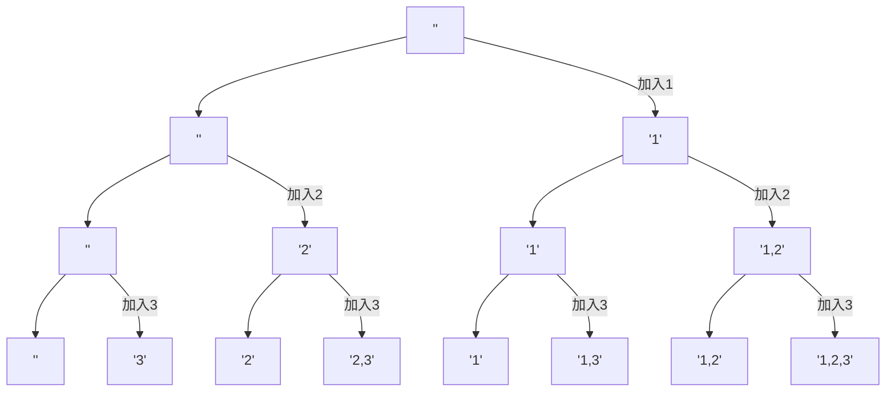

## 描述

该题来自于[力扣第78题](https://leetcode.cn/problems/subsets/)

<!--more-->

## 分析

给定一个集合`{1,2,3}`，求所有子集，一个容易想到的方法就是递归，比如先把`1`拿处理，求出`{2,3}`的所有子集，然后把`1`加进去；然后`2`拿出来，求`{3}`的所有子集；最后剩下把`3`和空集。

这里有一种更简单的迭代方法；
1. 加入空集`{}`
2. 上一步生成的所有子集中加入`1`，新增`{1}`，现有子集为`{}, {1}`
3. 上一步生成的所有子集中加入`2`，新增`{2}, {1, 2}`，现有子集为`{}, {1}, {2}, {1, 2}`
4. 上一步生成的所有子集中加入`3`，新增`{3}, {1, 3}, {2, 3}, {1, 2, 3}`，现有子集为`{}, {1}, {2}, {1, 2}, {3}, {1, 3}, {2, 3}, {1, 2, 3}`

完成，用图表示更清楚


## 代码

```python
class Solution:
    def subsets(self, nums: List[int]) -> List[List[int]]:
        ans = [[]]
        for e in nums:
            n = len(ans)
            for i in range(n):
                ans.append(ans[i].copy() + [e])
        return ans
```

