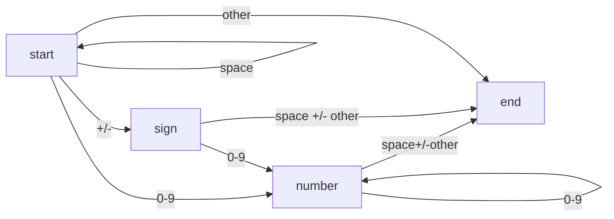

## 描述

该题来自于[力扣第八题](https://leetcode-cn.com/problems/string-to-integer-atoi)

请你来实现一个`atoi`函数，使其能将字符串转换成整数。

<!--more-->

首先，该函数会根据需要丢弃无用的开头空格字符，直到寻找到第一个非空格的字符为止。接下来的转化规则如下：

* 如果第一个非空字符为正或者负号时，则将该符号与之后面尽可能多的连续数字字符组合起来，形成一个有符号整数。
* 假如第一个非空字符是数字，则直接将其与之后连续的数字字符组合起来，形成一个整数。
* 该字符串在有效的整数部分之后也可能会存在多余的字符，那么这些字符可以被忽略，它们对函数不应该造成影响。


注意：假如该字符串中的第一个非空格字符不是一个有效整数字符、字符串为空或字符串仅包含空白字符时，则你的函数不需要进行转换，即无法进行有效转换。

在任何情况下，若函数不能进行有效的转换时，请返回`0`。

提示：

* 本题中的空白字符只包括空格字符`' '`。
* 假设我们的环境只能存储 32 位大小的有符号整数，那么其数值范围为 [−231,  231 − 1]。如果数值超过这个范围，请返回  INT_MAX (231 − 1) 或 INT_MIN (−231) 。
 

示例 1:
> 输入: "42"
输出: 42

示例 2:
> 输入: "   -42"
输出: -42
解释: 第一个非空白字符为 '-', 它是一个负号。
     我们尽可能将负号与后面所有连续出现的数字组合起来，最后得到 -42 。

示例 3:
> 输入: "4193 with words"
输出: 4193
解释: 转换截止于数字 '3' ，因为它的下一个字符不为数字。

示例 4:
> 输入: "words and 987"
输出: 0
解释: 第一个非空字符是 'w', 但它不是数字或正、负号。
     因此无法执行有效的转换。

示例 5:
> 输入: "-91283472332"
输出: -2147483648
解释: 数字 "-91283472332" 超过 32 位有符号整数范围。 
     因此返回 INT_MIN (−231) 。


## 分析

思路是遍历字符串，对每个字符单独处理，字符类型一共有四种：空格(space)，+/-，数字(0-9)，其他(other)；根据这四种类型分别处理，然后判断边界即可。
这里采用另一种代码的写法，利用状态机，根据不同的字符输入进行不同的状态转换，从而获得结果，其本质和上面的思路道理是一样的，但是状态机在计算机邻域非常通用，比如说硬件verilog语言应用就很多，而且正则表达式匹配的原理也使用到的状态机，故此采用状态机的写法。
首先可以定义状态，分为开始状态（start）、符号状态（sign）、数字状态（number）和结束状态（end），根据输入字符的不同，各个状态的转移图如下：



相应的状态转移表为：

|        | space | +/-  |  0-9   | other |
| :----: | :---: | :--: | :----: | :---: |
| start  | start | sign | number |  end  |
|  sign  |  end  | end  | number |  end  |
| number |  end  | end  | number |  end  |
|  end   |  end  | end  |  end   |  end  |

由状态转移表，根据输入的字符更换状态，并相应进行处理操作即可


## 代码

<details open>
<summary>python3</summary>

```python
class AtoiFSM:
    def __init__(self):
        self.state = "start"
        self.sign = 1
        self.val = 0
        self.table = {
                      #   space    +/-      0-9     other
            "start" :   ["start", "sign", "number", "end"],
            "sign"  :   ["end",   "end",  "number", "end"],
            "number":   ["end",   "end",  "number", "end"],
            "end"   :   ["end",   "end",  "end",    "end"], 
        }
    
    def _get_state_transfer_id(self, c):
        if c == " ":
            return 0
        elif c == "+" or c == "-":
            return 1
        elif c.isdigit():
            return 2
        else:
            return 3

    def run(self, c):
        # 状态转换
        self.state = self.table[self.state][self._get_state_transfer_id(c)]

        if self.state == "sign":
            self.sign = 1 if c == "+" else -1
        elif self.state == "number":
            self.val = self.val * 10 + int(c)
            self.val = min(self.val, 2**31-1) if self.sign == 1 else min(self.val, 2**31)
        elif self.state == "end":
            return self.sign * self.val
        return None


class Solution:
    def myAtoi(self, s):
        fsm = AtoiFSM()
        for c in s:
            res = fsm.run(c)
            if res is not None:
                return res
        return fsm.sign * fsm.val
```
</details>


<details>
<summary>c++</summary>

```cpp
class AtoiFSM {
    string state = "start";
    unordered_map<string, vector<string>> map = {
        {"start", {"start", "sign", "number", "end"} },
        {"sign", {"end",   "end",  "number", "end"}},
        {"number", {"end",   "end",  "number", "end"}},
        {"end", {"end",   "end",  "end", "end"}}
    };
public:
    long long val = 0;
    int sign = 1;
    
    int get_state_transfer_id(char c) {
        if (c == ' ') return 0;
        else if (c == '+' || c == '-') return 1;
        else if (isdigit(c)) return 2;
        return 3;
    }

    void run(char c) {
        state = map[state][get_state_transfer_id(c)];
        if (state == "sign") sign = c == '+' ? 1 : -1;
        else if (state == "number") {
            val = val * 10 + c - '0';
            val = sign == 1 ? min(val, (long long) INT_MAX) : min(val, - (long long) INT_MIN);
        }
    }
};

class Solution {
public:
    int myAtoi(string str) {
        AtoiFSM fsm = AtoiFSM();
        for (auto c : str) {
            fsm.run(c);
        }
        return (int)(fsm.sign * fsm.val);
    }
};
```
</details>


<details>
<summary>java</summary>

```java
import java.util.HashMap;
import java.util.Map;

class AtoiFSM {
    private String state = "start";
    public int sign = 1;
    public long val = 0;
    private Map<String, String[]> table = new HashMap<>();

    public AtoiFSM() {
        table.put("start", new String[]{"start", "sign", "number", "end"});
        table.put("sign", new String[]{"end", "end", "number", "end"});
        table.put("number", new String[]{"end", "end", "number", "end"});
        table.put("end", new String[]{"end", "end", "end", "end"});
    }

    private int getStateTransferID(char c){
        if (c == ' ') {
            return 0;
        }
        else if (c == '+' || c == '-') {
            return 1;
        }
        else if (Character.isDigit(c)){
            return 2;
        }
        return 3;
    }

    public void run(char c){
        state = table.get(state)[getStateTransferID(c)];
        if (state.equals("sign")) {
            sign = c == '+' ? 1 : -1;
        }
        else if (state.equals("number")){
            val = val * 10 + c - '0';
            val = sign == 1 ? Math.min(val, Integer.MAX_VALUE) : Math.min(val, - (long) Integer.MIN_VALUE);
        }
    }
}


class Solution {
    private AtoiFSM fsm = new AtoiFSM();
    public int myAtoi(String s) {
        for(int i = 0; i < s.length(); i++){
            fsm.run(s.charAt(i));
        }
        return (int) (fsm.sign * fsm.val);
    }
}
```
</details>